### Install the CLI

```bash
$ npm install -g @aws-amplify/cli
$ amplify congifure
```


### amplify configure 후

* AWS 콘솔 창이 열리면, AWS 콘솔 로그인

* 터미널로 돌아와서 

  * `Enter`
  * 리전 `ap-northeast-2` (서울)로 지정
  * IAM 유저 생성
    * `user name` : **ausg-amplify** 입력

* AWS 콘솔에서 다음과 같이 설정

  * 
    

  * 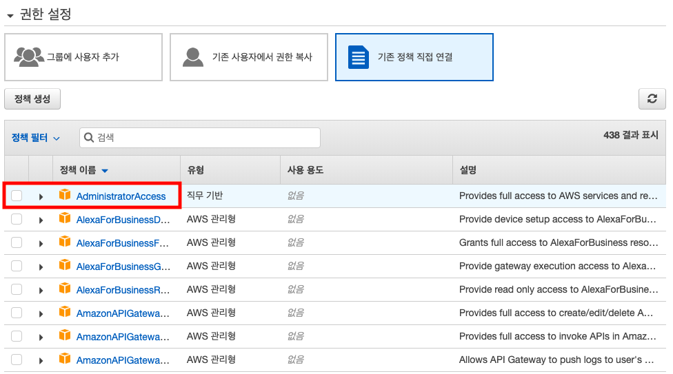

    

  * **다음** - **다음** - **사용자 만들기** 클릭

  

  * 빨간 네모 안의 내용들을 `.csv 다운로드` 하거나, 창을 그대로 놔두고 터미널로 이동합니다!
    

    

* 터미널에서

  * `Enter`
  * 
    *  `accessKeyId`에는  `액세스 키 ID`, `secretAccessKey`에는 `비밀 액세스 키`를 넣어주세요.
    * 새 유저가 만들어졌습니다!


### IAM 권한 설정

* 

  * 이 창을 그대로 열어두셨다면, `닫기` 버튼을 눌러주세요.

  * 이 창을 닫으셨다면,

    **콘솔** - **서비스** - **IAM 검색** - **사용자** 

* 

* 


#### CloudFormation 정책 추가하기

1. 
2. 
3. 
4. 
5. **권한 추가**


* 1~5번을 아래와 같이 5번 더 반복합니다!

  * Cognito Identity

  * Cognito User Pools

    

  * IAM

    

  * Lambda

    

  * S3

    

  * DynamoDB

* **정책 검토** 버튼을 클릭합니다

  * 
    * 정책의 **이름을 입력** 하고, `요약` 의 내용이 스크린샷과 동일한지 확인합니다.

* **정책 생성** 버튼을 클릭합니다


### create a new app

* 터미널에서

  * ```bash
    $ npm install -g create-react-app
    $ create-react-app ausgapp && cd ausgapp
    $ npm start
    ```

* 


### install Amplify

* `command + C`

* react app의 root directory에서

* ```bash
  $ npm install --save aws-amplify
  $ npm install --save aws-amplify-react
  ```


### Set Up the AWS Backend

* amplify init 하기

  ```bash
  $ amplify init
  ```

* 아래와 같이 작성해줍니다 
  ( `environment : dev`, `editor : Visual Studio Code` 를 제외하고는 다 엔터! )

  
  

* **? Do you want to use an AWS profile?** (Y/n)를 물으면 **Y** 입력 후 엔터

* **ausg-amplify** 선택


### Implementing Authentication

```bash
$ amplify add auth
```

* **Do you want to use the default authentication and security configuration?**
  * **Default configuration** 선택
* **How do you want users to be able to sign in when using your Cognito User Pool?**
  * **Username** 선택
* **What attributes are required for signing up?**
  * **Email** 선택


```bash
$ amplify push
```

* **Are you sure you want to continue?**
  * **Yes** 입력


### Adding Authentication to the React App

* **src/index.js** 수정

  ```react
  import Amplify from 'aws-amplify'
  import config from './aws-exports'
  Amplify.configure(config)
  ```

  

* **src/App.js** 수정

  ```react
  //파일의 맨 위에 추가
  import { withAuthenticator } from 'aws-amplify-react'
  
  //파일의 맨 밑 줄 대체
  export default withAuthenticator(App)
  ```


### 앱 실행

```bash
// Build Command
$ npm run-script build
// Start Command
$ npm run-script start
```


* Create account —> 작성한 **이메일** 로 온 인증코드 입력 —> 로그인


## Cognito 살펴보기


* AWS 콘솔 - 서비스 - Cognito 검색


* 사용자 풀 관리 클릭

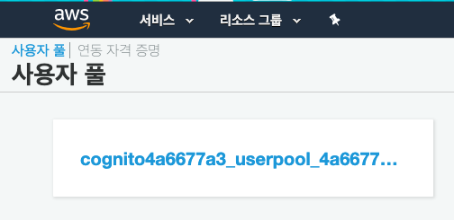

* 우리가 만들어 둔 사용자 풀! 클릭합니다


### 속성

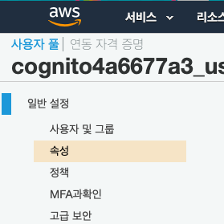

* 왼쪽 메뉴에서 일반 설정 - 속성을 클릭합니다

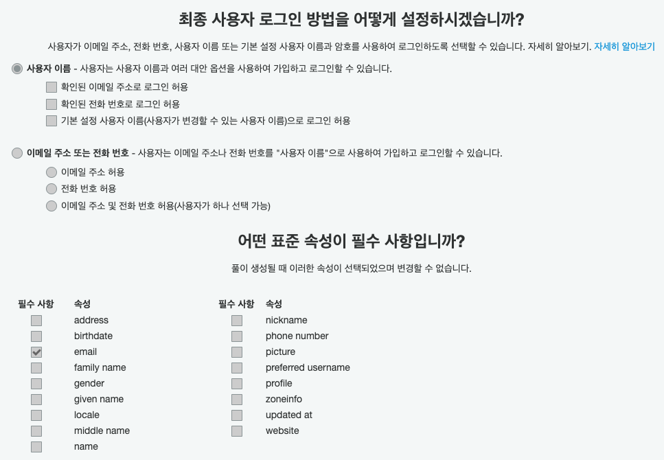

* `amplify add auth`시 설정했던 사항들 확인 가능! (**변경 불가**)


### 정책

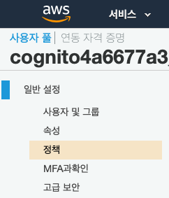

* 왼쪽 메뉴에서 일반 설정 - 정책을 클릭합니다.


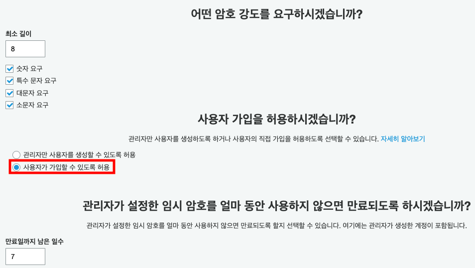

* 암호 강도, 사용자 가입 허용 여부 등을 설정할 수 있습니다.

* 여러분들은 `사용자가 가입할 수 있도록 허용` 상태일 텐데요, 

  

  저는 `관리자만 사용자를 생성할 수 있도록 허용` 으로 바꿔보겠습니다!

  콘솔에서 ` 변경 내용 저장` 을 누른 후, 터미널에서 `npm run-script start` 또는 `npm start` 를 실행해보겠습니다.

* 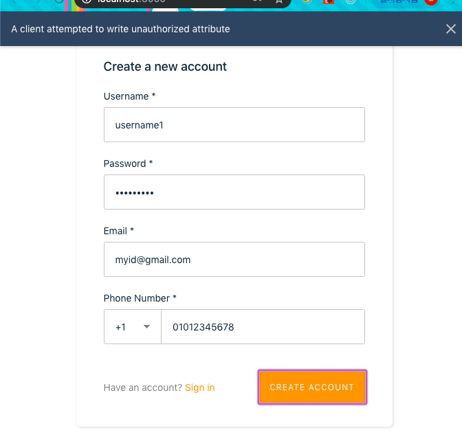

  위와 같이, `CREATE ACCOUNT` 버튼을 클릭하면 `A client attempted to write unauthorized attribute` 오류가 뜨는 것을 볼 수 있네요!


### Creating The Serverless Backend Services

```bash
// 프로젝트의 루트 디렉토리에서
$ amplify add api
```

* **? Please select from one of the below mentioned services**
  * `REST` 선택
* **? Provide a friendly name for your resource to be used as a label for this category in the project**
  * `todoAPI` 입력
* **? Provide a path (e.g., /items) **
  * `Enter`
* **? Choose a Lambda source**
  * `Create a new Lambda function` (Enter)

* **? Provide a friendly name for your resource to be used as a label for this category in the project**
  * `todoLambda` 입력
* **? Provide the AWS Lambda function name**
  * `todo` 입력
* **? Choose the function template that you want to use**
  * `CRUD function for Amazon DynamoDB table (Integration … )` 선택
* **? Choose a DynamoDB data source option**
  * `Create a new DynamoDB table` 선택

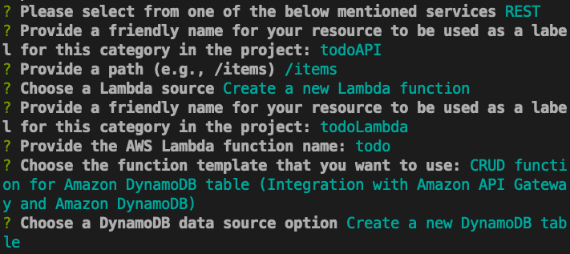


#### NoSQL DynamoDB database wizard 

로 진입했습니다! wizard를 사용해서 NoSQL 데이터베이스 테이블 세팅을 해 봅시다!


* **? Please provide a friendly name for your resource that will be
  used to label this category in the project**
  * `todoTable` 입력
* **? Please provide table name**
  * `todo` 입력


테이블에 column을 추가 해 봅시다.


* **? What would you like to name this column**
  * `id`
* **? Please choose the data type**
  * `string`
* **? Would you like to add another column?**
  * `No`


데이터베이스를 생성하기 전에, Primary key를 정해줍니다.

> Primary key : 데이터베이스 설계자나 관리자는 여러 후보키 중에서 기본적으로 사용할 키를 반드시 선택해야 하는데 이것이 기본키(**primary key**)


그 후에 secondary indexes를 설정할거냐고 물어보는데, n을 입력 해 줍니다.


**Succesfully added DynamoDb table locally** 메세지가 나와야 합니다!


Local lambda function 을 수정할거냐고 묻는데, n을 입력 해 줍니다.


API에 접근하는 것을 제한할지 묻는데,  y를 입력 후 아래와 같이 진행해줍니다.


> `a` 를 눌러 전체선택 해준 후 엔터를 눌러줍니다


unauthenticated users, 즉 Guest 유저에게는 `read` 권한만 부여 해 줍니다.

space 를 눌러서 선택 후 엔터를 눌러줍니다.


**Successfully updated auth resource locally** 메세지가 나와야 합니다!


API에 다른 path를 추가할지 묻는데, n을 입력 해 줍니다.


**Successfully added resource todoAPI locally** 라는 메세지가 나오면 끝납니다!


#### amplify add api

`amplify add api`  라는 명령어로 REST API를 생성해 봤는데요, 이 API를 만들기 위해서 4가지 AWS

서비스가 사용되었습니다! 그 4가지 서비스를 살펴보도록 할게요.


1. Amazon DynamoDB
   * NoSQL 데이터베이스로 제공됨
   * ` todoTable` 리소스를 추가했을 때 `todo`라는 DynamoDB 테이블을 만듦
   * `id`가 primary key인 3개의 columns
2. AWS Lambda functions
   * 서버관리나 프로비저닝 없이 코드를 실행할 수 있게 해줌
   * DynamoDB 테이블에서 CRUD 동작이 일어나는 부분
3. Amazon Cognito
   * authentication , user management 를 위해 필요
   * 회원가입, 로그인, 접근 제한
4. Amazon API Gateway
   * REST API endpoint를 만들게 해 줌
   * path가 `item` 인 리소스! 이름은 `todoApi`


####  권한 추가

Lambda, Cognito는 아까 IAM 권한을 추가 해 줬는데, DynamoDB와 API Gateway는 추가해 주지 않은 상태입니다! 아까와 같은 방식으로 추가 해 줍니다


* DynamoDB


* API Gateway

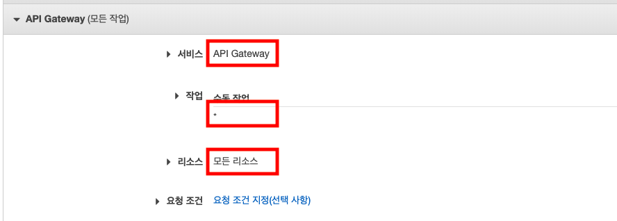

* 요약의 내용이 아래와 같은지 확인합니다.

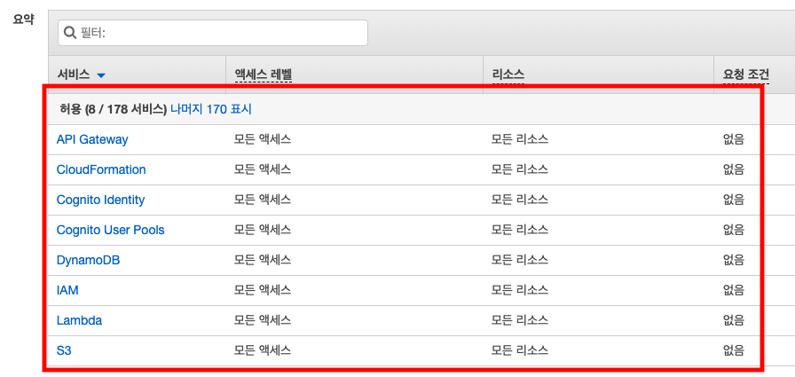


그런데, 지금 이런 서비스들의 세부사항이 클라우드에 올라가지 않은 상태입니다.

먼저, 명령어 `amplify status`를 실행합니다. 

> amplify 프로젝트에 대한 정보를 표로 보여줍니다

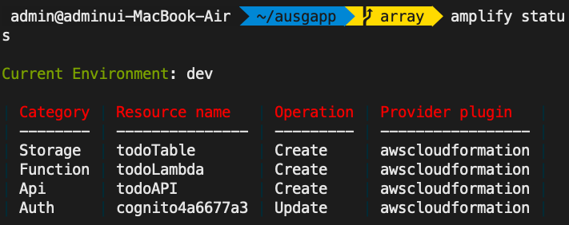

> API set up 과정에서 설정한 정보들은
>
> 프로젝트 root 폴더에서 amplify/backend/function/todoLambda/src/app.js 에서 확인 및 수정이 가능합니다!


Operation에 Create, Update 등 클라우드에 반영되지 않은 내용을 확인할 수 있습니다!

(클라우드와 비교해 변화가 없다면 No Change로 표시됩니다.)


`amplify push` 명령어로 클라우드에도 반영해 줍니다. (y를 눌러줍니다)


### Building The Frontend

`amplify push` 명령어가 정상적으로 수행됐다면, **src** 폴더에 **aws-exports.js** 파일이 생긴 것을 보실 수 있습니다!

이 파일은 클라우드에 생성된 리소스들의 정보를 담고 있어요. push 명령어가 수행될 때 마다 업데이트됩니다.

이 파일은 JavaScript 프로젝트를 위해 만들어진 파일이고, Amplify JavaScript library에서 사용됩니다.

이 파일을 사용해서 React 프로젝트를 만들어 봅시다!


#### public/index.html 파일을 열어줍니다

**\<head> 와 \</head> 사이에** 아래 코드를 복사 해 붙여넣어 줍니다.

```html
<link
  rel="stylesheet"
  href="https://stackpath.bootstrapcdn.com/bootstrap/4.1.3/css/bootstrap.min.css"
  integrity="sha384-MCw98/SFnGE8fJT3GXwEOngsV7Zt27NXFoaoApmYm81iuXoPkFOJwJ8ERdknLPMO"
  crossorigin="anonymous"
/>
<script
  src="https://code.jquery.com/jquery-3.3.1.slim.min.js"
  integrity="sha384-q8i/X+965DzO0rT7abK41JStQIAqVgRVzpbzo5smXKp4YfRvH+8abtTE1Pi6jizo"
  crossorigin="anonymous"
></script>
<script
  src="https://cdnjs.cloudflare.com/ajax/libs/popper.js/1.14.3/umd/popper.min.js"
  integrity="sha384-ZMP7rVo3mIykV+2+9J3UJ46jBk0WLaUAdn689aCwoqbBJiSnjAK/l8WvCWPIPm49"
  crossorigin="anonymous"
></script>
<script
  src="https://stackpath.bootstrapcdn.com/bootstrap/4.1.3/js/bootstrap.min.js"
  integrity="sha384-ChfqqxuZUCnJSK3+MXmPNIyE6ZbWh2IMqE241rYiqJxyMiZ6OW/JmZQ5stwEULTy"
  crossorigin="anonymous"
></script>
```

* Bootstrap을 사용합니다!


#### src/List.js 파일을 만들어줍니다

```javascript
import React from "react";
export default props => (
  <div>
    <legend>List</legend>
    <div className="card" style={{ width: "25rem" }}>
      {renderListItem(props.list, props.loadDetailsPage)}
    </div>
  </div>
);
function renderListItem(list, loadDetailsPage) {
  const listItems = list.map(item => (
    <li
      key={item.id}
      className="list-group-item"
      onClick={() => loadDetailsPage(item.id)}
    >
      {item.title}
    </li>
  ));
  return <ul className="list-group list-group-flush">{listItems}</ul>;
}
```

* 위 코드를 복사 후 붙여넣기 해 만들어주세요!

* API에서 item들의 리스트를 render 해 올 컴포넌트입니다


#### src/Details.js 파일을 만들어줍니다

```javascript
import React from "react";
export default props => (
  <div>
    <h2>Details</h2>
    <div className="btn-group" role="group">
      <button
        type="button"
        className="btn btn-secondary"
        onClick={props.loadListPage}
      >
        Back to List
      </button>
      <button
        type="button"
        className="btn btn-danger"
        onClick={() => props.delete(props.item.id)}
      >
        Delete
      </button>
    </div>
    <legend>{props.item.title}</legend>
    <div className="card">
      <div className="card-body">{props.item.content}</div>
    </div>
  </div>
);
```

* 삭제 버튼, 목록 버튼, item의 세부사항을 표시해주는 컴포넌트입니다


#### src/App.js 파일을 열고 덮어 써 줍니다

```javascript
import React, { Component } from "react";
import List from "./List";
import Details from "./Details";
import Amplify, { API } from "aws-amplify";
import aws_exports from "./aws-exports";
import { withAuthenticator } from "aws-amplify-react";
Amplify.configure(aws_exports);
class App extends Component {
  constructor(props) {
    super(props);
    this.state = {
      content: "",
      title: "",
      list: [],
      item: {},
      showDetails: false
    };
  }
  async componentDidMount() {
    await this.fetchList();
  }
  handleChange = event => {
    const id = event.target.id;
    this.setState({ [id]: event.target.value });
  };
  handleSubmit = async event => {
    event.preventDefault();
    await API.post("todosApi", "/items", {
      body: {
        id: Date.now().toString(),
        title: this.state.title,
        content: this.state.content
      }
    });
    this.setState({ content: "", title: "" });
    this.fetchList();
  };
  async fetchList() {
    const response = await API.get("todosApi", "/items");
    this.setState({ list: [...response] });
  }
  loadDetailsPage = async id => {
    const response = await API.get("todosApi", "/items/" + id);
    this.setState({ item: { ...response }, showDetails: true });
  };
  loadListPage = () => {
    this.setState({ showDetails: false });
  };
  delete = async id => {
    //TODO: Implement functionality
  };
  render() {
    return (
      <div className="container">
        <form onSubmit={this.handleSubmit}>
          <legend>Add</legend>
          <div className="form-group">
            <label htmlFor="title">Title</label>
            <input
              type="text"
              className="form-control"
              id="title"
              placeholder="Title"
              value={this.state.title}
              onChange={this.handleChange}
            />
          </div>
          <div className="form-group">
            <label htmlFor="content">Content</label>
            <textarea
              className="form-control"
              id="content"
              placeholder="Content"
              value={this.state.content}
              onChange={this.handleChange}
            />
          </div>
          <button type="submit" className="btn btn-primary">
            Submit
          </button>
        </form>
        <hr />
        {this.state.showDetails ? (
          <Details
            item={this.state.item}
            loadListPage={this.loadListPage}
            delete={this.delete}
          />
        ) : (
          <List list={this.state.list} loadDetailsPage={this.loadDetailsPage} />
        )}
      </div>
    );
  }
}
export default withAuthenticator(App, true);
```


`npm start`

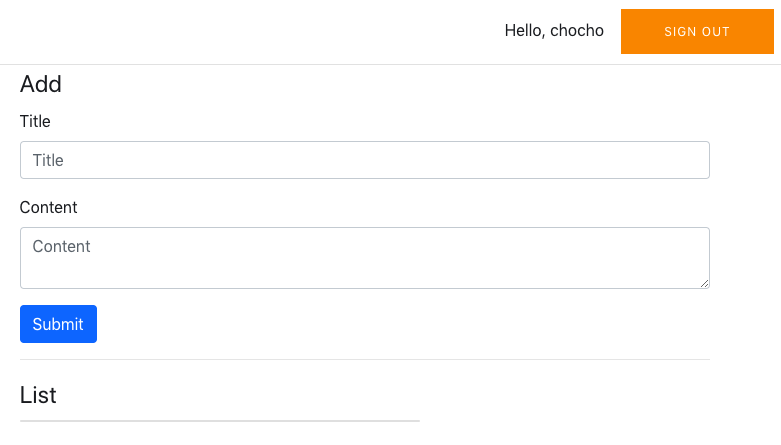


